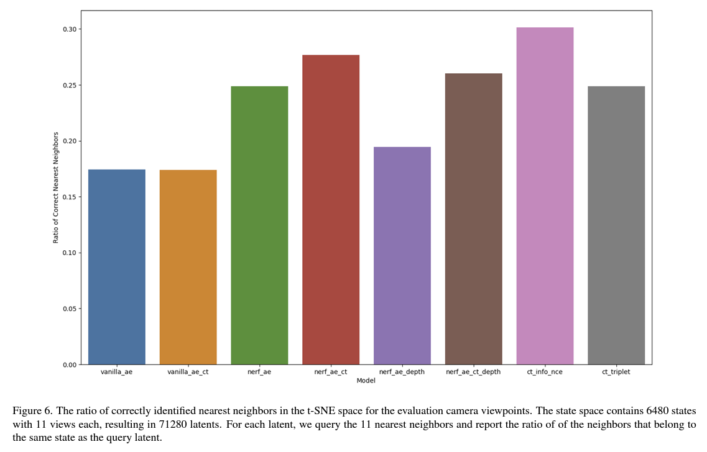

# 3D Neural Scene Representations for View-Invariant State Representation Learning

My course project for MIT's [Advances in Computer Vision](http://6.8300.csail.mit.edu/sp23/) class.

## Installation

Clone the repo and execute the following commands from the repository's root.

Create a virtual environment:
```
python -m venv state_encoder_3d_env
```

Activate the environment:
```
source state_encoder_3d_env/bin/activate
```

Install the `state_encoder_3d` package in development mode:
```
pip install -e .
```

## Training and Evaluation

Training data can be generated using `scripts/generate_planar_cube_data.py`.
All training, evaluation, and visualization scripts can be found in the `scripts/` folder.

## Results

A detailed report can be found [here](./state_encoder_3d_report.pdf).

The below figure is taken from the report and compares the performance of different models.


